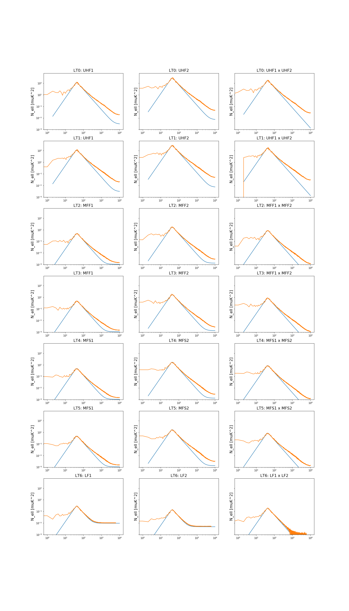
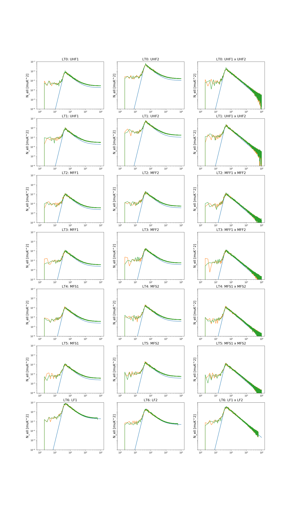
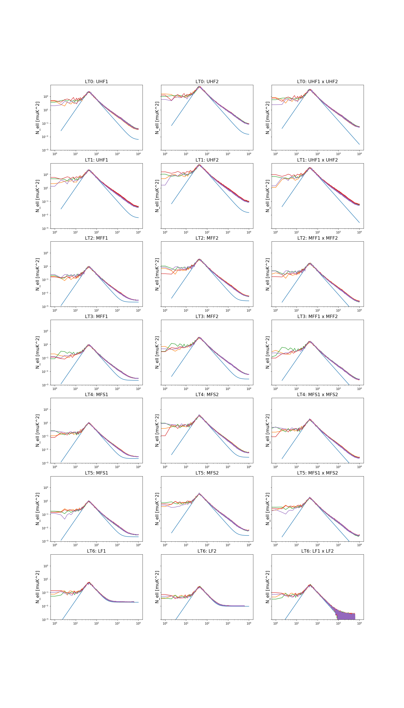
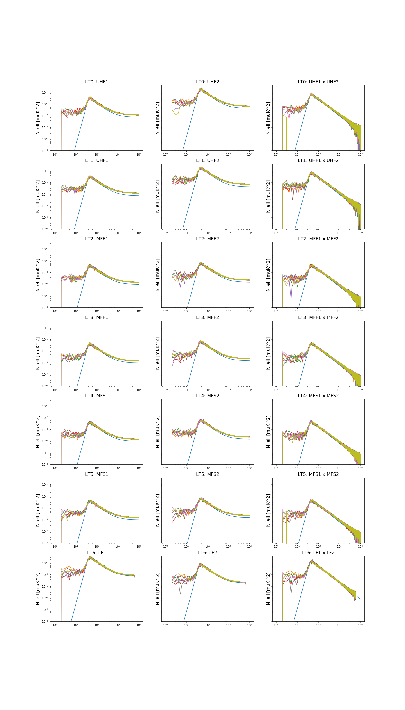

Realistic noise version 3.1.1 with MSS1 hitmaps
===============================================

Tag: `mbs-s0008-20200221`

Release date 21 Feb 2020

New noise release using version 3.1.1 of the noise curves from [`so_noise_models`](https://github.com/simonsobs/so_noise_models).

Compared to previous releases:

* Updated noise spectra which include a fix for the atmosphere parameters
* Includes cross-correlations between the 2 bands in the same dichroic tube
* Uses new hitmaps from the MSS1 time domain simulations
* Supports noise splits
* Variable Nside based on channels
* Released in HEALPix and (later) in CAR 

## Input components

All maps are in `uK_CMB`, IQU, single precision (`float32`)

* For the exact configuration of the noise simulations refer to the `noise.toml` configuration file available in this repository.
For all available options refer to the [`SONoiseSimulator` class in `mapsims`](https://mapsims.readthedocs.io/en/latest/api/mapsims.SONoiseSimulator.html#mapsims.SONoiseSimulator).

## Available maps

Only 1 realizations of the full mission and 1 realization of 4 splits are made available as maps.

Reference frame for noise maps is assumed to be **Equatorial**.

**Location at NERSC**:

    /project/projectdirs/sobs/v4_sims/mbs/202002_noise

The naming convention is:

    {num:04d}/simonsobs_{content}_uKCMB_{tube}_{band}_nside{nside}_{num:04d}_{split}_of_{nsplits}.fits"

where:

* `content` is `noise`
* `num` is the realization number (seed) and currently only `0`
* `tube` is `LT0`-`LT6` or `ST0`-`ST3`
* `band` is one of the available bandpasses (available inside `mapsims.so_utils`):

        bands = ("LF1", "LF2", "MFF1", "MFF2", "MFS1", "MFS2", "UHF1", "UHF2")
        frequencies = (27, 39, 93, 145, 93, 145, 225, 280)

* `nsplits` is the number of splits, 1 for full mission, 4 for the splits, `split` is 1 based split ID.

For example: `0000/simonsobs_noise_uKCMB_ST2_MFS2_nside512_0000_1_of_1.fits`

Total disk space used is 345 GB for one realization of full mission and splits.

Backed up to tape in `~zonca/sobs/mbs/202002_noise`.

## Generate other realizations on the fly

More noise realizations should be generated on-the-fly and never written to disk using the `mapsims` package, check the documentation at <https://mapsims.readthedocs.io> for installation instructions.

Then check the [`run_mapsims_onthefly.ipynb`](run_mapsims_onthefly.ipynb) notebook.

The interface of `mapsims` for on-the-fly simulations is still work in progress, in the next weeks we will also release the capability of running foregrounds + cmb + noise maps and we will also improve the interface to make it easier to only create a single `mapsims.MapSim` object and loop easily through channels and noise realizations.

## Hitmaps

Hitmaps are used un-normalized to scale the pixel-by-pixel noise.
They are available at NERSC in:

    /global/project/projectdirs/sobs/www/so_mapsims_data/v0.2

Or [via web through NERSC](https://portal.nersc.gov/project/sobs/so_mapsims_data/v0.2/)

Or they can be accessed through the `load_hitmaps` method of `mapsims.SONoiseSimulator`.

## Software

* The noise component and the runner script are available in the [`mapsims`](https://github.com/simonsobs/mapsims) package, version 2.1.0, see the [documentation](https://mapsims.readthedocs.io/en/2.1.dev)

## Spectra plots

For validation purposes, see a comparison between the input spectra as generated by `so_noise_models` and a power spectrum (simple `anafast` with no mask deconvolution).

Spectra were generated with the `compute_cl_noise_full.py` and `compute_cl_noise_splits.py` scripts and plotted with `plot_cl_noise_full.ipynb` and `plot_cl_noise_splits.ipynb`.

### LAT Temperature

### LAT Polarization

### LAT Temperature splits

### LAT Polarization splits

